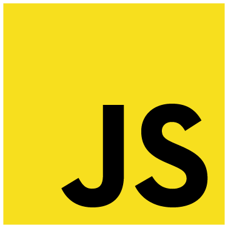

<h1>
  Темы для подготовки к собеседованию по JavaScript
  
</h1>

## Мотивация

Собрать, структурировать, переосмыслить базовые темы по JavaScript

## Темы в форме вопросов

- [Какие типы данных существуют?](./topcis/base_types.md)
- [В чем различия `var` `let` `const` и что такое `hosing`?](./topcis/var_let_const_hosting.md)
- [Как происходит приведение типов?](./topcis/type_conversions.md)
- [Что такое замыкание и как оно работает?](./topcis/closure.md)
- [Что такое event-loop и как он работает?](./topcis/event_loop.md)
- [Что такое итератор, генератор и как ими пользоваться?](./topcis/generator_iterator.md)
- [Какие коллекции существуют?](./topcis/collections.md)
- [Как создавать асинхронный код?](./topcis/async.md)
- [Что такое Runtime?](./topcis/runtime.md)
- [Сборка мусора | Как происходит сборка ненужных объектов?](./topcis/garbage_collect.md)
- [Как вести отладку когда в Google Chrome?](./topcis/debugging.md)