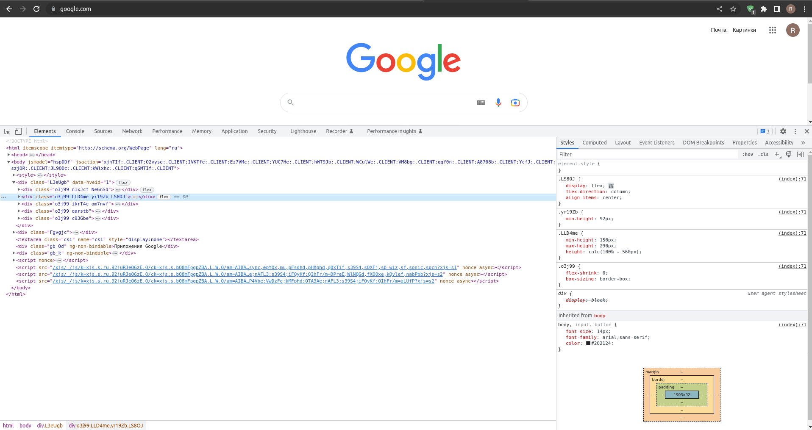
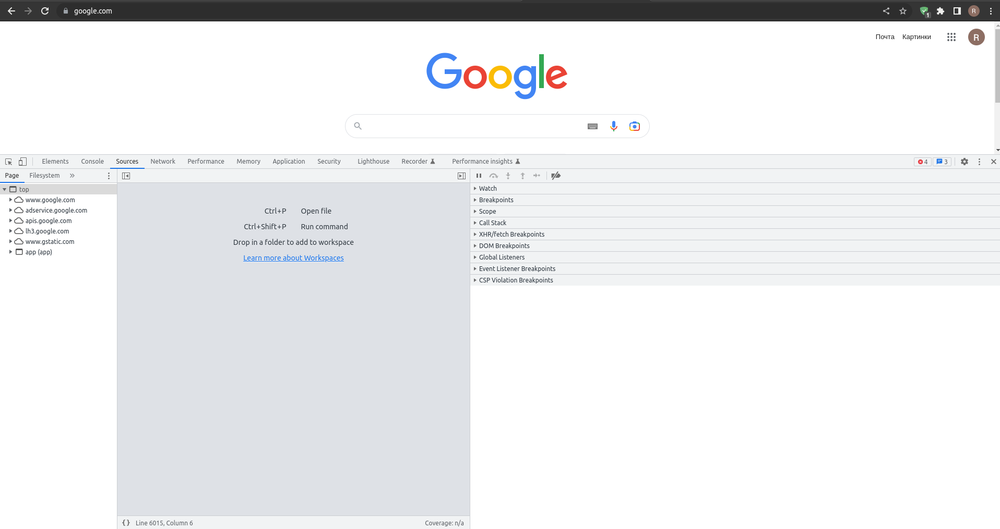
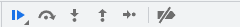
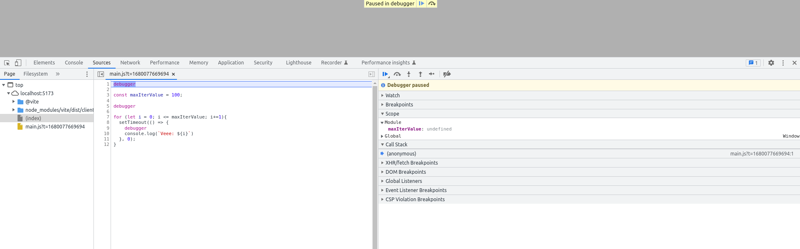
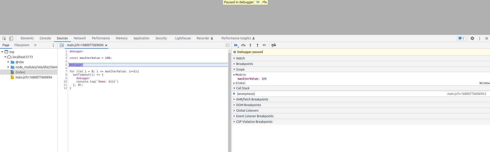

# Как вести отладку когда в Google Chrome?

## Содержание

## Что такое отладка и зачем она нужна?

Для начало стоит отметить, а что же такое отладка кода или debugging?

> Отладка – это процесс поиска и исправления ошибок, которые можно получить в ходе "ручного тестирования" в [`runtime`](./runtime.md)

Отлично, получается, что отладка это часть тестирования. В целом данное утверждение логично, так как процесс отладка напоминает этапы тестирования, да и само тестирование.

## Отладка кода в google-chrome

Думаю, что большая часть функций будет схожа между браузерами.

Для начала откроем google.com и инструменты разработчика



Теперь необходимо выбрать вкладку `Sources`



В этой вкладе есть все, что необходимо для базовой отладки

В правой части есть разделы:

- Watch– показывает текущие значения для любых выражений. Вы можете нажать на + и ввести выражение. Отладчик покажет его значение, автоматически пересчитывая его в процессе выполнения.
- Call Stack – показывает цепочку вложенных вызовов.
- Scope показывает текущие переменные.
  - Local - показывает локальные переменные функций, а их значения подсвечены прямо в исходном коде.
  - Global - перечисляются глобальные переменные (то есть вне каких-либо функций).
  - this - ссылка на this



Описание иконок (навигации):

- «Resume»: продолжить выполнение, быстрая клавиша F8
  > Возобновляет выполнение кода. Если больше нет точек останова, то выполнение просто продолжается, без контроля отладчиком.
- «Step»: выполнить следующую команду, быстрая клавиша F9
- «Step over»: выполнить следующую команду, но не заходя внутрь функции, быстрая клавиша F10
- «Step into», быстрая клавиша F11
- «Step out»: продолжить выполнение до завершения текущей функции, быстрая клавиша Shift+F11
- активировать/деактивировать все точки останова(breakpoints).

## Пример

```js
debugger

const maxIterValue = 100;

debugger

for (let i = 0; i <= maxIterValue; i+=1){
  setTimeout(() => {
    debugger
    console.log(`Veee: ${i}`)
  }, 0);
}
```

и посмотрим на `Sources`



На первой точки "остановке" видно, что уже работает [`hosting`](./var_let_const_hosting.md) и переменная `maxIterValue` имеет значение `undefined`

Переходим на следующий этап - (F8)



Тут сразу же видно, что переменная `maxIterValue` имеет значение.
Отлично, теперь становится, понятно, что можно проверить значение некоторых важных переменных.

Идем дальше (F8)


Тут становится еще интереснее, теперь у нас появился контекст `this`, а так же изменилось наименование `scope`

На предыдущем шаге scope был - `Module`, а теперь `Block`
В `Call stack` появилось `setTimeout`

И так далее до конца скрипта

## Источники данных

- [Отладка в браузере](https://learn.javascript.ru/debugging-chrome)